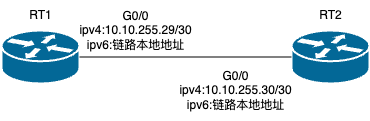

#### 2022年国赛真题
- 利用 BGP MPLS VPN 技术，RT1 与 RT2 以太链路间运行多协议标签交换、标签分发协议。RT1 与 RT2 间创建财务 VPN 实例，名为CW，RT1 的 RD 值为 1:1，export rt 值为 1:2，import rt 值为 2:1；RT2 的 RD 值为 2:2。通过两端 loopback1建立 VPN 邻居，分别实现两端 loopback5 ipv4 互通和 ipv6 互通。
- 拓扑图

```shell
#R1配置
RT1#show run
Building configuration...

Current configuration:
!
hostname RT1
!
ipv6 unicast-routing
ipv6 vrf CW
 rd 1:1
 route-target import 2:1
 route-target export 1:2
!
mpls label range 1024 2208
mpls ip
mpls ldp router-id 10.10.4.1
!
ip vrf CW
 rd 1:1
 route-target export 1:2
 route-target import 2:1
!
isdn switch-type basic-5ess
!
aaa authentication login default local
aaa authentication enable default none
aaa authentication ppp default local
aaa authorization exec default local
!
username admin password 0 admin
!
interface Loopback1
 ip address 10.10.4.1 255.255.255.255
 ipv6 enable
 ipv6 address 2001:10:10:4::1/128
 ipv6 ospf 1 area 0
!
interface Loopback5
 ip vrf forwarding CW
 ip address 10.10.4.5 255.255.255.255
 ipv6 enable
 ipv6 address 2001:10:10:4::5/128
 ipv6 vrf forwarding CW
!
interface GigaEthernet0/0
 ip address 10.10.255.29 255.255.255.252
 ipv6 enable
 mpls ip
 mpls ldp enable
 ipv6 ospf 1 area 0
!
interface GigaEthernet0/1
 no ip address
!
interface GigaEthernet0/2
 no ip address
!
interface GigaEthernet0/3
 ip address 192.168.2.1 255.255.255.0
 ip nat inside
!
interface Serial1/0
 no ip address
!
interface Serial1/1
 no ip address
!
router ospf 1
 network 10.10.4.1 255.255.255.255 area 0
 network 10.10.255.28 255.255.255.252 area 0
!
router bgp 65001
 no synchronization
 bgp log-neighbor-changes
 neighbor 10.10.5.1 remote-as 65002
 neighbor 10.10.5.1 ebgp-multihop 255
 neighbor 10.10.5.1 update-source Loopback1
 neighbor 2001:10:10:5::1 remote-as 65002
 neighbor 2001:10:10:5::1 ebgp-multihop 255
 neighbor 2001:10:10:5::1 update-source Loopback1
 no neighbor 2001:10:10:5::1 activate

 address-family vpnv4
 neighbor 10.10.5.1 activate
 neighbor 10.10.5.1 send-community extended
 exit-address-family

 address-family ipv6
 no synchronization
 neighbor 2001:10:10:5::1 activate
 exit-address-family

 address-family vpnv6
 neighbor 10.10.5.1 activate
 neighbor 10.10.5.1 send-community extended
 exit-address-family

 address-family ipv4 vrf CW
 no synchronization
 network 10.10.4.5/32
 exit-address-family

 address-family ipv6 vrf CW
 no synchronization
 redistribute connected
 exit-address-family
!
router ospfv3 1
 router-id 1.1.1.1


#R2配置
RT2#show run
Building configuration...

Current configuration:
!
hostname RT2
!
ipv6 unicast-routing
ipv6 vrf CW
 rd 2:2
 route-target import 1:2
 route-target export 2:1
!
mpls label range 1024 2208
mpls ip
mpls ldp router-id 10.10.5.1
!
!
ip vrf CW
 rd 2:2
 route-target export 2:1
 route-target import 1:2
!
isdn switch-type basic-5ess
!
aaa authentication login default local
aaa authentication enable default none
aaa authentication ppp default local
aaa authorization exec default local
!
username admin password 0 admin
!
crypto key load-keyconf end
!
interface Loopback1
 ip address 10.10.5.1 255.255.255.255
 ipv6 enable
 ipv6 address 2001:10:10:5::1/128
 ipv6 ospf 1 area 0
!
interface Loopback5
 ip vrf forwarding CW
 ip address 10.10.5.5 255.255.255.255
 ipv6 enable
 ipv6 address 2001:10:10:5::5/128
 ipv6 vrf forwarding CW
!
interface GigaEthernet0/0
 ip address 10.10.255.30 255.255.255.252
 ipv6 enable
 mpls ip
 mpls ldp enable
 ipv6 ospf 1 area 0
!
interface GigaEthernet0/1
 ip address 192.168.2.1 255.255.255.0
!
interface GigaEthernet0/2
 no ip address
!
interface GigaEthernet0/3
 no ip address
!
interface Serial1/0
 no ip address
!
interface Serial1/1
 no ip address
!
router ospf 1
 network 10.10.255.28 255.255.255.252 area 0
 network 10.10.5.1 255.255.255.255 area 0
!
router bgp 65002
 no synchronization
 bgp log-neighbor-changes
 neighbor 10.10.4.1 remote-as 65001
 neighbor 10.10.4.1 ebgp-multihop 255
 neighbor 10.10.4.1 update-source Loopback1
 neighbor 2001:10:10:4::1 remote-as 65001
 neighbor 2001:10:10:4::1 ebgp-multihop 255
 neighbor 2001:10:10:4::1 update-source Loopback1
 no neighbor 2001:10:10:4::1 activate

 address-family vpnv4
 neighbor 10.10.4.1 activate
 neighbor 10.10.4.1 send-community extended
 exit-address-family

 address-family ipv6
 no synchronization
 neighbor 2001:10:10:4::1 activate
 exit-address-family

 address-family vpnv6
 neighbor 10.10.4.1 activate
 neighbor 10.10.4.1 send-community extended
 exit-address-family

 address-family ipv4 vrf CW
 no synchronization
 network 10.10.5.5/32
 exit-address-family

 address-family ipv6 vrf CW
 no synchronization
 redistribute connected
 exit-address-family
!
!
router ospfv3 1
 router-id 2.2.2.2


```