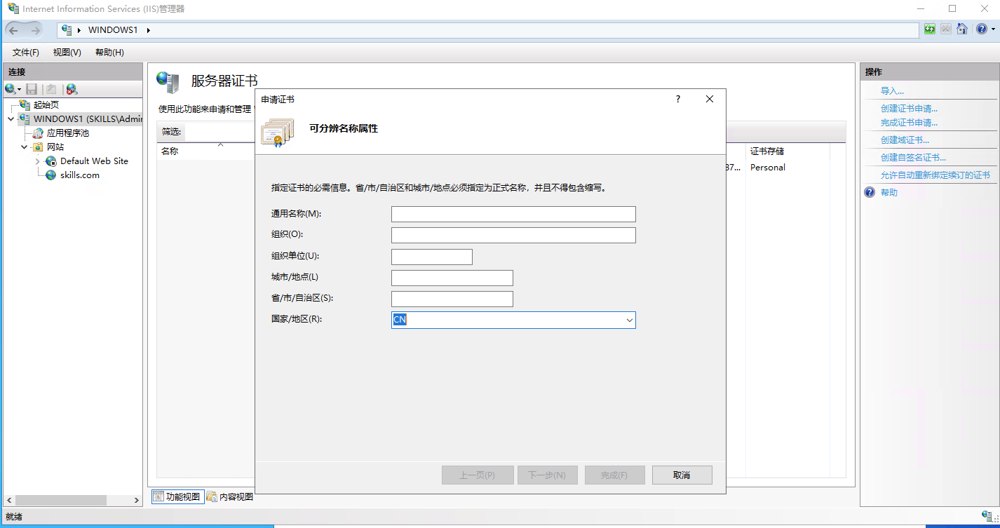

# Apache服务器开启必须使用客户端证书使用Linux和Windows分别访问

- 实验拓扑结构: 

| 角色     | IP地址            | 组件         |
| :-------       | :---------- | :------------|
| CA_server      | 192.168.3.21 | openssl, CA |
| Apache         | 192.168.3.22 | Apache 2.4,domain:skills.com  |
| Linux_client   | 192.168.3.23 |             |
| Windows_client | 192.168.3.31 |             |


- ##### CA_server配置:
  - 配置CA_server作为证书颁发机构,使用如下命令:
    - 创建CA的私钥: 
	```
	openssl genrsa -out myCA.key 2048
	```
	- 创建CA根证书颁发机构:
	```
    openssl req -x509 -new -key myCA.key -days 3650 -out myCA.pem	
    ```
- ##### Apache服务器配置:
  - 安装apache和mod_ssl组件
  - 使用如下命令生成apache服务器私钥:
   ```
   openssl genrsa -out skills.key
   ```
  - 创建extensions文件用来申请服务器证书
```
vim skills.ext
#添加内容如下:
authorityKeyIdentifier=keyid,issuer
basicConstraints=CA:FALSE
keyUsage = digitalSignature, nonRepudiation, keyEncipherment, dataEncipherment
subjectAltName = @alt_names
extendedKeyUsage=serverAuth,clientAuth    #证书支持服务器验证和客户端验证
[alt_names]
DNS.1 = *.skills.com
```

 - 创建Apache服务器证书申请(CSR):
  ```
  openssl req -new -key skills.key -out skills.csr
  ``` 
 - 将证书申请使用拷贝到CA_server上来申请Apache服务器证书:
  ```
  openssl ca -keyfile myCA.key -cert myCA.pem -in skills.csr -out skills.crt -extfile skills.ext
  ```
 - 使用如下验证客户端证书是否有效
  ```
   openssl verify -CAfile myCA.pem -verify_hostname www.skills.com skills.crt
   如果出现:
   skills.crt: OK
   表示证书有效
  ```

 - 将申请好的skill.crt证书拷贝到Apache服务器
 - 配置Apache服务器:

  ```
    vim /etc/httpd/conf.d/ssl.conf
 
    SSLCertificateFile /etc/ssl/skills.crt
    SSLCertificateKeyFile /etc/ssl/skills.key
    SSLCertificateChainFile /etc/ssl/myCA.pem     //证书链指向根证书
    SSLCACertificateFile /etc/ssl/myCA.pem

    SSLVerifyClient require    //开启需要客户端证书验证
    SSLVerifyDepth  10
  ```

##### 使用Linux_client访问Apache服务
 - 将skills.crt、skills.key、myCA.pem复制到Linux_client客户机的/etc/ssl下,使用如下curl命令访问apache服务器:
```
curl --cacert myCA.pem --cert skills.crt --key skills.key --url https://www.skills.com
```
 - 使用如下验证客户端证书是否有效

##### 使用Windows_client访问Apache服务

 - 创建证书申请:

 ```
 开始-> mmc -> 添加管理单元 -> 选择证书 -> 证书-当前用户 -> 在右边空白处右键-> 所有任务 -> 高级操作 -> 创建自定义请求 -> 
 不使用注册策略继续 -> (无模版)CNG密钥 下一步 -> 属性 -> 在使用者选项卡中添加证书的国家,组织单位，等信息，保存请求文件名为Windows.csr
 ```

 - 申请客户端证书:
 ```
 将创建好的证书请求复制到CA_server上去,使用如下命令申请Windows客户端证书:
 openssl ca -keyfile myCA.key -cert myCA.pem -in Windows.csr -out client.crt -days 365
 ```
 
 - 应用Windows客户端证书:
 
 ```
 将myCA.pem复制到Windows的本地计算机->受信任的根证书颁发机构，将client.crt复制到当前用户->个人证书中。
 ```

 - 验证证书是否有效
 
 ```
 使用浏览器访问Apache查看证书是否生效
 ```

##### Windows IIS 向 Linux 申请服务器证书访问 web 服务
- 利用 IIS 的证书申请创建证书请求，ws.txt

- 将创建好的 ws.txt 请求文件拷贝到 linux 的CA服务器上,并使用以下指令创建证书文件:
```shell
openssl ca -keyfile /etc/pki/CA/private/cakey.pem -cert /etc/pki/CA/cacert.pem -in ws.txt -out client1.crt -days 365 -extfile skills.ext
#skills.ext的内容和上面一样
````

- 将申请好的 client1.crt 导入到windows主机的计算机个人证书中，就可以用了