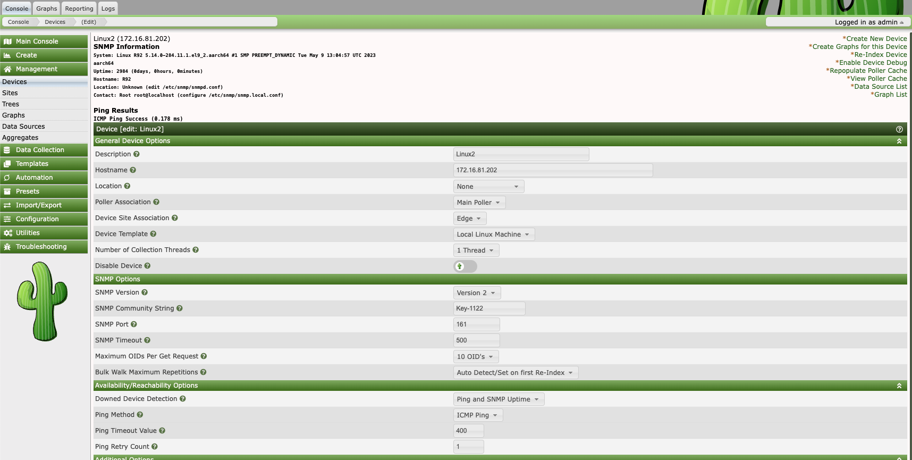
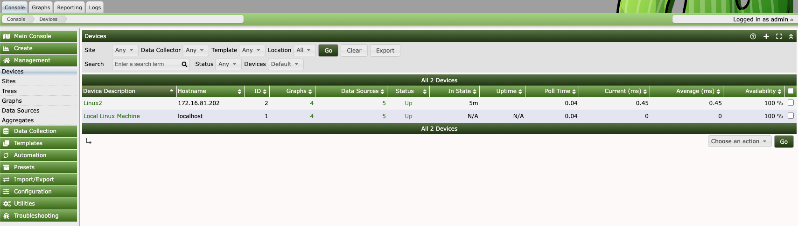

## cacti部署
- 系统环境: Rocky Linux 9.2 Arm64

- 部署过程:
```shell
##安装和配置基本组建
#apache
dnf install httpd httpd-tools

#php
dnf install php php-xml php-session php-sockets php-ldap php-gd php-json php-mysqlnd php-gmp php-mbstring php-posix php-snmp php-intl

#配置php参数
$ sudo vi /etc/php.ini

date.timezone = Asia/Shanghai
memory_limit = 512M
max_execution_time = 60
max_input_vars = 1000

systemctl restart php-fpm

#mariadb
dnf install mariadb-server

#配置maraidb数据库的root密码
mysql_secure_installation
               
mysql -u root -p
CREATE DATABASE cacti;
ALTER DATABASE cacti CHARACTER SET utf8mb4 COLLATE utf8mb4_unicode_ci;
GRANT ALL ON cacti.* TO cacti@localhost IDENTIFIED BY 'Key-1122';
FLUSH privileges;
exit;

vi /etc/my.cnf.d/mariadb-server.cnf
collation-server=utf8mb4_unicode_ci
character-set-server=utf8mb4
max_heap_table_size=128M
tmp_table_size=128M
join_buffer_size=256M
innodb_buffer_pool_size=2GB
innodb_buffer_pool_instances=10
innodb_flush_log_at_timeout=3
innodb_read_io_threads=32
innodb_write_io_threads=16
innodb_io_capacity=5000
innodb_doublewrite = off
innodb_file_format=Barracuda
innodb_large_prefix=1
innodb_io_capacity_max=10000

systemctl restart mariadb

#倒入mysql.time_zone_name时间表
mysql -u root -p mysql < /usr/share/mariadb/mysql_test_data_timezone.sql

mysql -u root -p
GRANT SELECT ON mysql.time_zone_name TO cacti@localhost;
FLUSH privileges;
exit;

##安装和配置SNMP, RRDtool
dnf install net-snmp net-snmp-utils net-snmp-libs rrdtool

#远程更新源安装cacti
dnf install cacti

#本地安装cacti
cd /opt/cacti/arm64
rpm -Uvh *.rpm --nodeps --force

#倒入cacti数据库
mysql -u root -p cacti < /usr/share/doc/cacti/cacti.sql

vi /usr/share/cacti/include/config.php

/* make sure these values reflect your actual database/host/user/password */
$database_type = "mysql";
$database_default = "cacti";
$database_hostname = "localhost";
$database_username = "cacti";
$database_password = "Key-1122";
$database_port = "3306";
$database_ssl = false;

#修改cacti计划任务
vim /etc/cron.d/cacti
#去掉注释
*/5 * * * *    apache  /usr/bin/php /usr/share/cacti/poller.php > /dev/null 2>&1

#修改apache访问权限
vi /etc/httpd/conf.d/cacti.conf


Alias /cacti /usr/share/cacti
<Directory /usr/share/cacti/>
            <IfModule mod_authz_core.c>
                         # httpd 2.4
                         #将 Require host localhost 改为 Require all granted.
                         Require all granted
            </IfModule>
            <IfModule !mod_authz_core.c>
                         # httpd 2.2
                         Order deny,allow
                         Deny from all
                         #将 Allow from localhost to Allow from all表示所有网段都能访问
                         #或者可以限制IP或者网段Allow from 192.168.200.0/24
                         Allow from 192.168.200.0/24 #Allow your local subnet
            </IfModule>
</Directory>

systemctl restart httpd

#部署结束，使用下面的url就可以访问cacti了
http://your-ip-address/cacti

登陆默认账号密码为admin

首次登陆之后要修改密码
```

- 在cacti中添加snmp主机用于监控
- 基本配置
```shell
#在客户机安装snmp服务
dnf install net-snmp net-snmp-utils net-snmp-libs rrdtool

#假设这里我们修改snmp客户机的团体字符串为Key-1122
vim /etc/snmp/snmpd.conf

#修改如下内容为:
com2sec notConfigUser  default       public
#修改为
com2sec notConfigUser  default       Key-1122

#修改完成后重新启动snmp服务
systemctl restart snmpd
```

- 通过web ui添加linux2进入snmp主机


- 添加完成后可以在manager中查看Linux2主机状态为"UP"

