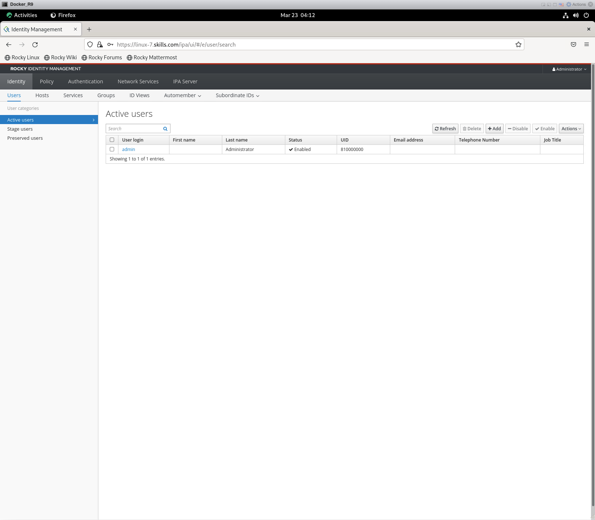
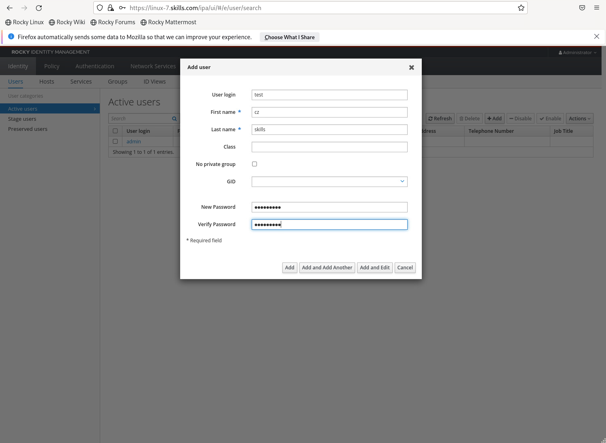
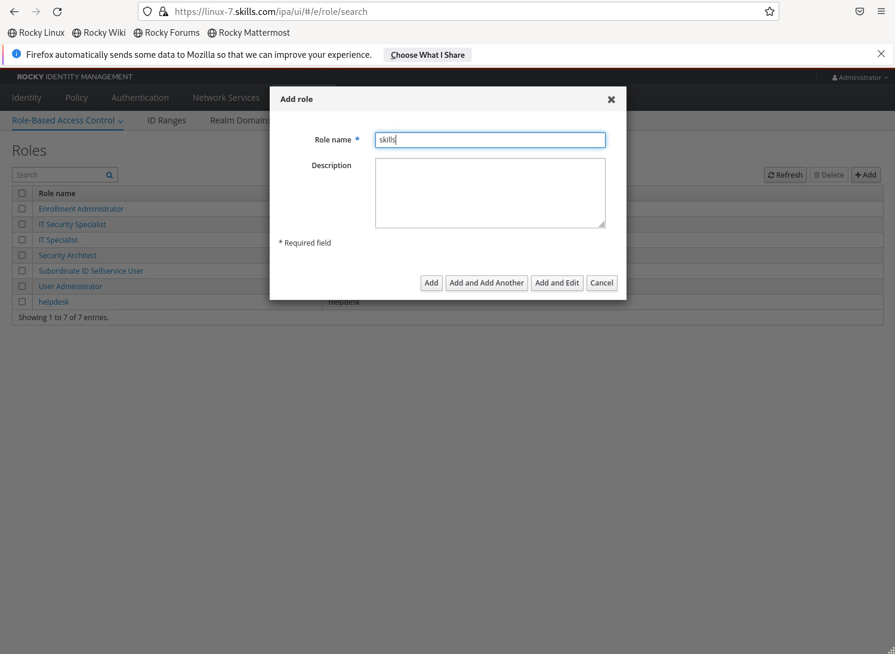
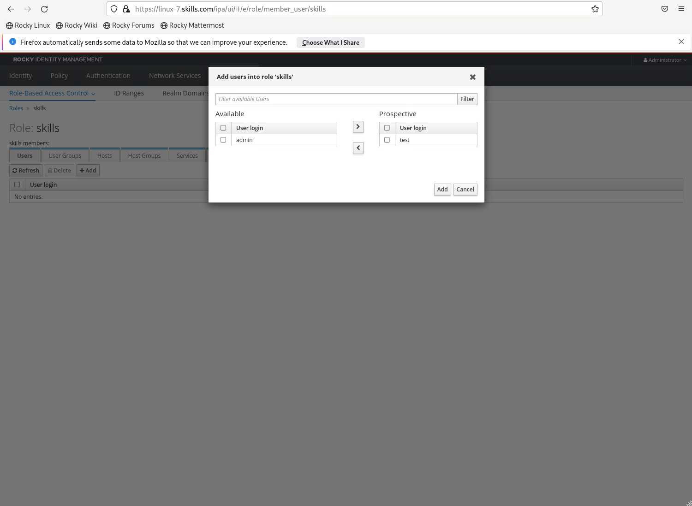
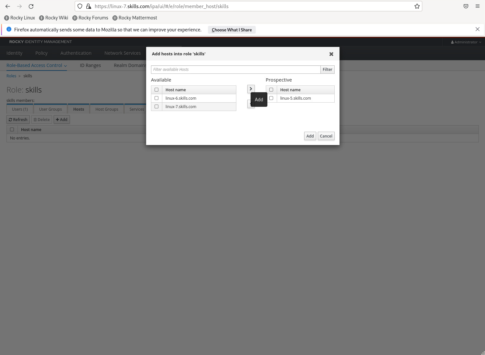
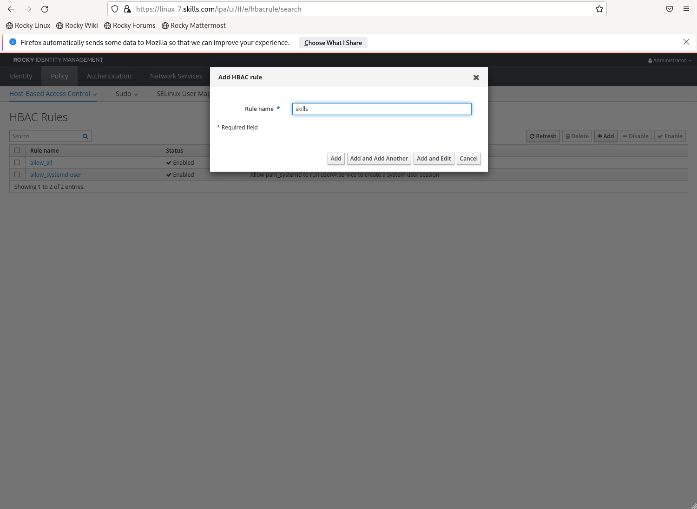
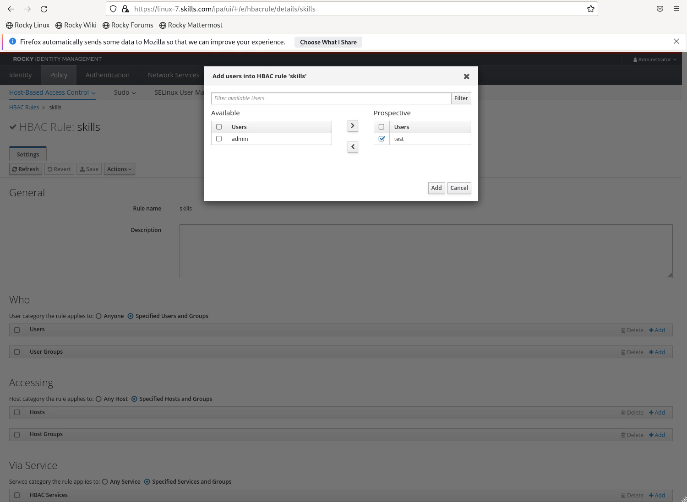
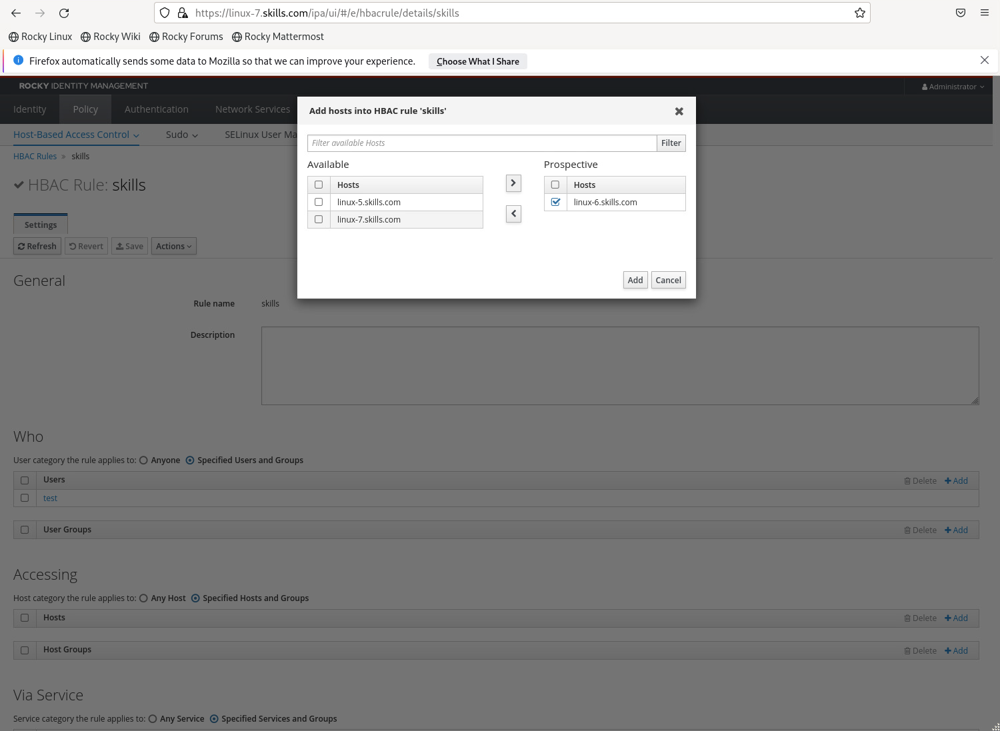
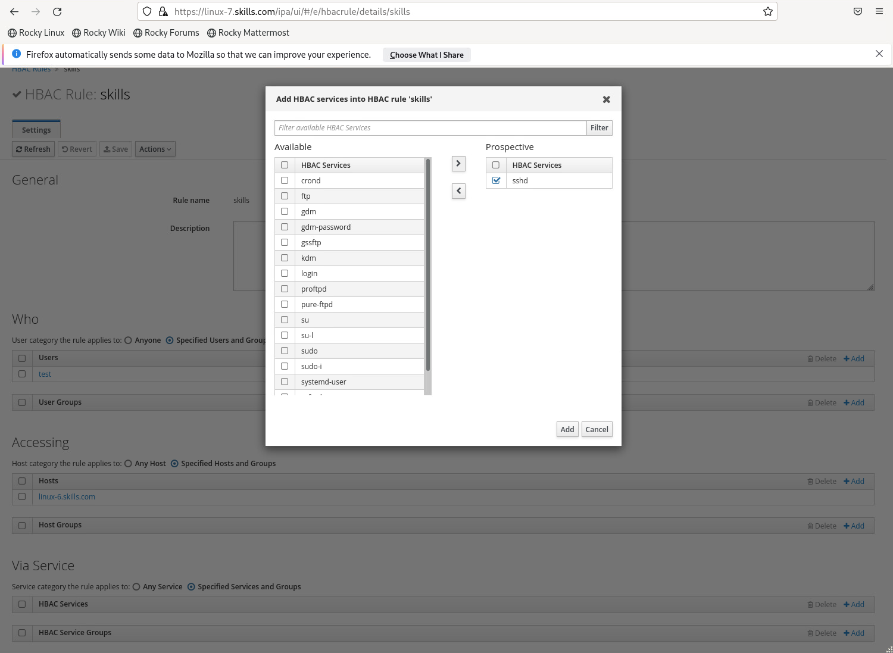
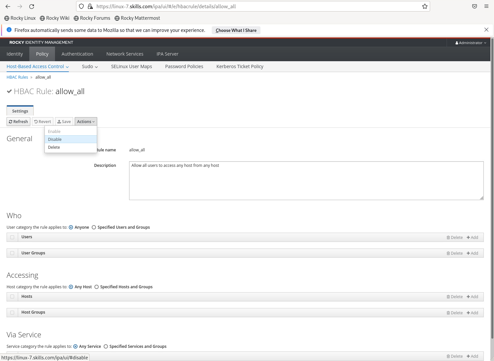

### Freeipa
- 赛题描述:
  - 【任务】FreeIPA可以简单构建一个单点登录系统，实现统一认证和策略管理等相应功能。 
    - 在linux7上安装FreeIPA-server端，域名服务器及时间服务器指向linux1，IPA服务名称: ipa.skills.com ，Domain name: skills.com，Realm name:SKILLS.COM，防火墙放开相应服务端口。
    - 在linux5~linux6上安装FreeIPA-client端，将客户端主机加入ipa.skills.com。
    - 在服务器端添加test用户，密码：PasS-1234， 修改或添加其他用户相关属性：姓: skills、名: cz。
    - 在服务器端添加角色：skills，test用户及linux5主机归属其中。
    - 在服务器端添加HBAC规则：skills，规则实现test用户可以ssh到linux6，不能 SSH 到linux5，禁用系统规则allow_all。


#### 解题思路
- Freeipa 服务端配置
```shell
#安装freeipa 包
yum module list idm 
yum -y install @idm:DL1
yum -y install freeipa-server

#配置服ipa-server
ipa-server-install   

#检查服务器是否配置成功
ipactl status

#检查ipad管理员用户
kinit admin
Password for admin@EXAMPLE.COM:

#查看票据
klist
Ticket cache: KCM: 0
Default principal: admin@EXAMPLE.COM

Valid startina                Expires                    Service principal
2020 - 10-04T13:23:3220    20-10-05T13:23:25         krbtgt/EXAMPLE.COM@EXAMPLE.COM

authconfig --enablemkhomedir --update
#这个指令的作用是在 Linux 系统中启用自动创建用户家目录的功能。具体而言，--enablemkhomedir 参数指示 authconfig 启用 mkhomedir 模块，该模块可以自动创建用户家目录；而 --update 参数则指示 authconfig 更新系统的 PAM (Pluggable Authentication Modules) 配置文件，以便启用该模块。
#使用该指令后，系统将在用户首次登录时自动创建其家目录。这对于管理大量用户的系统管理员而言非常方便，可以节省手动创建家目录的时间和工作量。

#卸载ipa-server
ipa-server-install--uninstall
```


- Freeipa 客户端配置(linux5和linux6都需要进行安装和配置)
```shell
#安装freeipa客户端包
yum install freeipa-client

#在 Linux 系统上安装并配置 FreeIPA 客户端这个指令也用于将客户端加入freeipa服务端
#本题需要使用这个命令行将客户端主机加入Freeipa，否则无法获得票据
ipa-client-install --mkhomedir --force-ntpd
#--mkhomedir: 指示在用户第一次登录时自动创建其家目录。
#--force-ntpd: 指示安装时强制同步系统时间与 FreeIPA 服务器的时间，以确保 Kerberos 身份验证和其他时间相关的功能正常工作
```

- **说明：后续配置可以通过Freeipa的可视化界面进行配置，找一台主机，只需要将DNS指向能解析ipa.skills.com的DNS服务器，然后使用浏览器访问https://10.10.70.107就会自动跳转到Freeipa的可视化配置界面**


- 添加用户
  - 在服务器端添加test用户，密码：PasS-1234， 修改或添加其他用户相关属性：姓: skills、名: cz。 
  
  - 指令模式
   ```shell
   ipa user-add test #创建用户test
   
   ipa user-mod test --password  #修改test用户密码
   ```


- 添加角色
  - 在服务器端添加角色：skills，test用户及linux5主机归属其中。
  
  
  
  - 指令模式
   ```shell
   ipa role-add skills  #创建角色skills
   
   ipa role-add-member skills --users=test #将test用户加入角色skills
   
   ipa role-add-member skills --hosts=linux-5.skills.com #将freeipa客户机加入角色skills   
   ```

- 添加HBAC规则
 - 在服务器端添加HBAC规则：skills，规则实现test用户可以ssh到linux6，不能 SSH 到linux5。
 - **说明:这里如果要实现linux5不可以ssh,linux6可以ssh,只需要将linux6客户端主机加入HBAC规则就可以了**
 
 
 
 
  - 指令模式
   ```shell
   ipa hbacrule-add skills  #创建hbac规则skills

   ipa hbacrule-add-service skills --hbacsves=sshd  #将ssh服务加入skills规则

   ipa hbacrule-add-user skills --user=test         #将test用户加入hbac规则

   ipa hbacrule-add-host skills --hosts=linux-6.skills.com  #将客户机加入hbac规则

   ipa hbactest --user=test --host=linux-6.skills.com --service=sshd    #测试hbac规则
   ```

- 禁用系统规则allow_all

- 指令模式
   ```shell
   ipa hbacrule-disable allow_all  #禁用默认系统规则
   ```