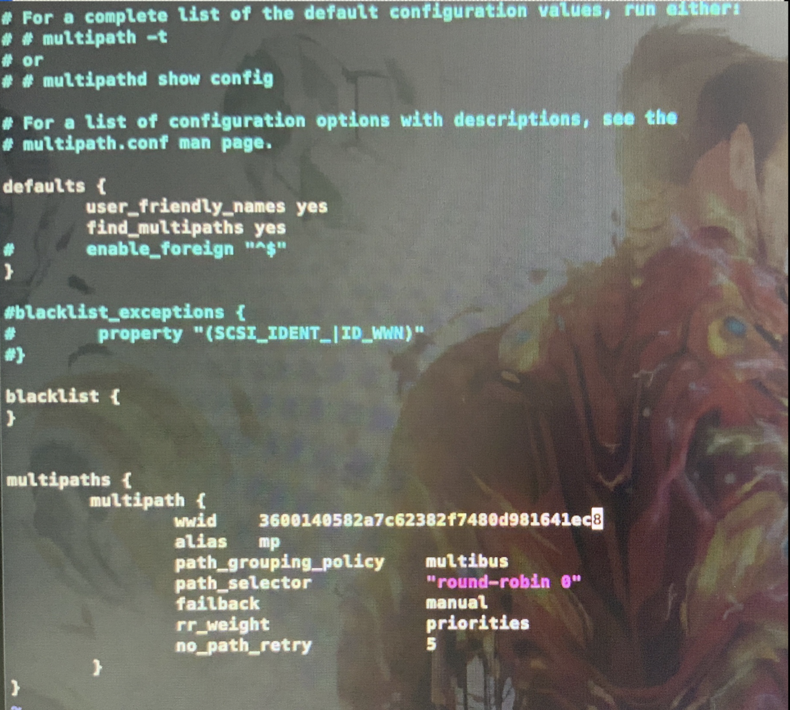

## 题目
- 配置 Linux-6 和 Linux7 为 iSCSI 客户端，实现 discovery chap 和 session chap 双向认证，Target 认证用户名为 IncomingUser，密码为 IncomingPass；Initiator 认证用户名为 OutgoingUser，密码为 OutgoingPass。实现多路径访问，路径别名为 mp，选择方式为轮询。

### 多路径在客户端配置，本题需要首先完成iscsi目标端连接,并且保证目标端和客户端主机至少使用两块网卡的地址做iscsi连接（如果只用一块网卡地址连接iscsi目标端，无法进行多路径配置）

- 安装multipath软件包

```shell
yum install device-mapper-multipath device-mapper
```

- 创建multipath配置文件
- 方法一: 利用mpathconf生成
```shell
mpathconf --enable
mpathconf --with_multipathd y
mpathconf --with_module y
```

- 方法二:复制配置文件模版
```shell
cp /usr/share/doc/device-mapper-multipath/multipath.conf /etc/multipath.conf
```

- 启动服务器并配置为开机自启动
```shell
systemctl start multipathd
systemctl enable multipathd
```

- 利用multipath指令查看wwid编号
`multipath -l`
- 如果这里没有任何输出，表是未发现任何多路径设备，需要检查multipath是否正确配置

- 修改配置路径别名为 mp，选择方式为轮询。
```shell
vim /etc/multipath.conf
```


- 重新加载配置
`systemctl reload multipathd`