# 样题需求
>  **1.在 windows1 上安装证书服务，证书颁发机构有效期为 20 年， 颁发证书有效期 10年，证书信息：公用名=skills.com，国家 =CN，省 =Beijing，城市=Beijing，组织=Skills，组织单位=System。chrome 浏 览器访问 https网站时，不出现证书警告提示信息。**
>  
>  **2.在 windows2 上安装从属证书服务，证书颁发机构有效期为 20 年， 颁发证书有效期 10年，证书信息：公用名=skills.com，国家 =CN，省 =Beijing，城市=Beijing，组织=Skills，组织单位=System。**
>  
>  **3.域中主机（含域控制器）自动申请“计算机”模板证书，自动注册“工作站身份验证”模板证书，该模板可用作“服务器身份验证”。**


## 样题拓扑图
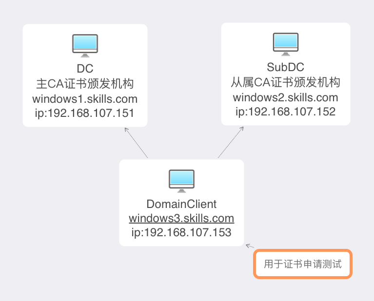

## 具体步骤:
- **1.安装主 DC的证书颁发机构,并配置如下参数:证书颁发机构有效期为 20 年，公用名=skills.com，国家 =CN，省 =Beijing，城市=Beijing，组织=Skills，组织单位=System**
+ (1).在可分辨名称后缀输入,具体修改方法见下图:
` C=CN,S=Beijing,L=Beijing,O=Skills,OU=System,DNS=*.skills.com `
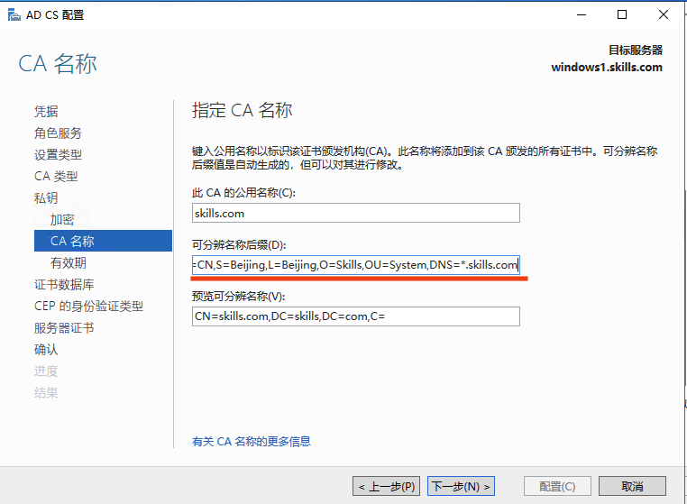
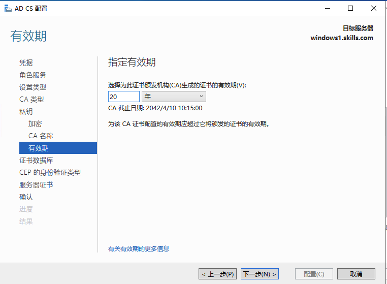

+ (2).修改证书颁发证书有效期 10年没,修改代码如下:
  
```shell
certutil -setreg CA\ValidityPeriod Years  //修改有效期单位为年*
certutil -setreg CA\ValidityPeriodUnits 10  //修改有效期10年*
net stop certsvc && net start certsvc   //重启证书服务*
```

---

+ **2.安装从属颁发机构，并且修改时间为证书颁发机构有效期为20年，颁发证书有效期10年。**
+ (1).在主CA制作一份**从属证书颁发机构**模版的副本:
` 打开主CA的证书颁发机构->选择证书模版->在空白处右键->管理`


+ (2).选择从属证书颁发机构:
` 右键复制模版 `
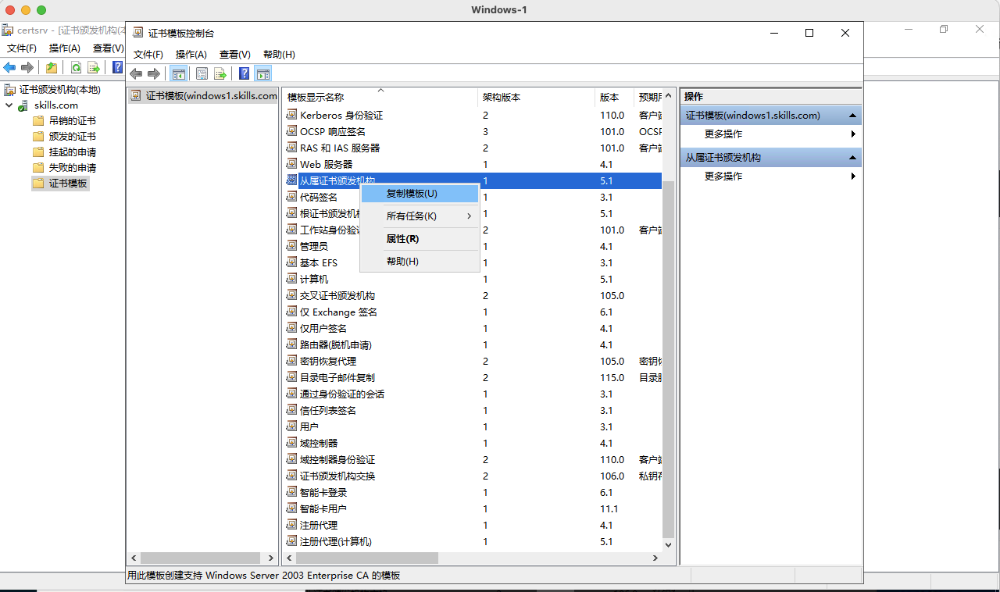
`修改证书有效期为10年->勾选在Active Directoy中发布证书->选择安全选项卡将域管理权限赋齐`
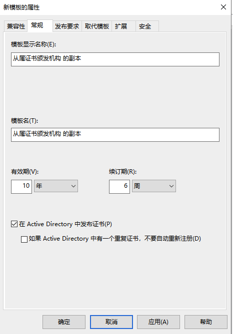


+ (3).回到证书模版右键:
`选择新建->要颁发的证书模版 `

`选择从属证书颁发机构 的副本->确定 `
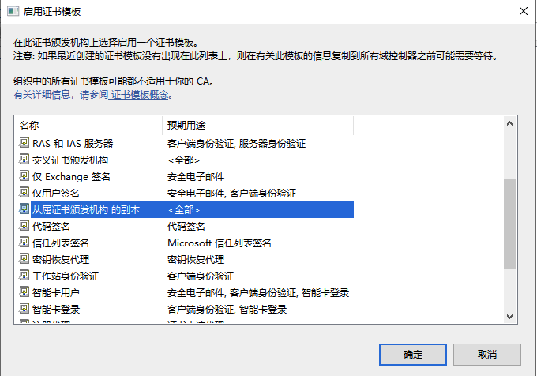

+ (4).接下来我们需要在SubDC上先申请一封从属证书颁发机构证书，使用的证书模版为刚刚创建的**从属证书颁发机构 的副本
` 在SubDC上打开MMC->选择证书->选择计算机账户->点击个人->在空白处右键->所有任务->高级操作->创建自定义请求`
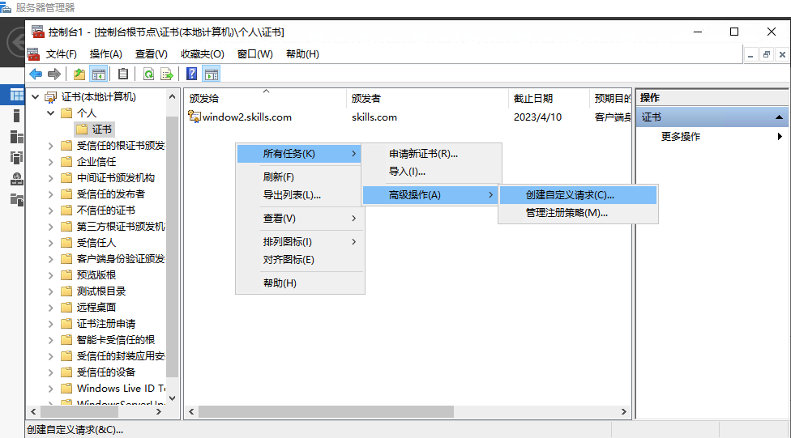
`点击下一步->选择Active Directory 注册策略点击下一步->选择模版为[从属证书颁发机构 的副本]点击下一步`
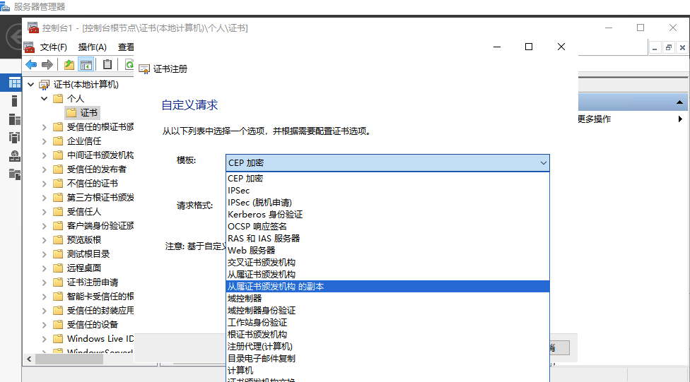
`点击详细信息->属性->设置证书基本信息:公用名=skills.com，国家 =CN，省 =Beijing，城市=Beijing，组织=Skills，组织单位=System->点击确定->点击下一步`
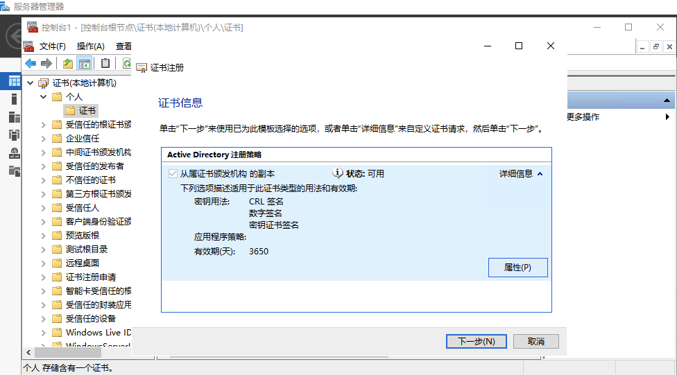
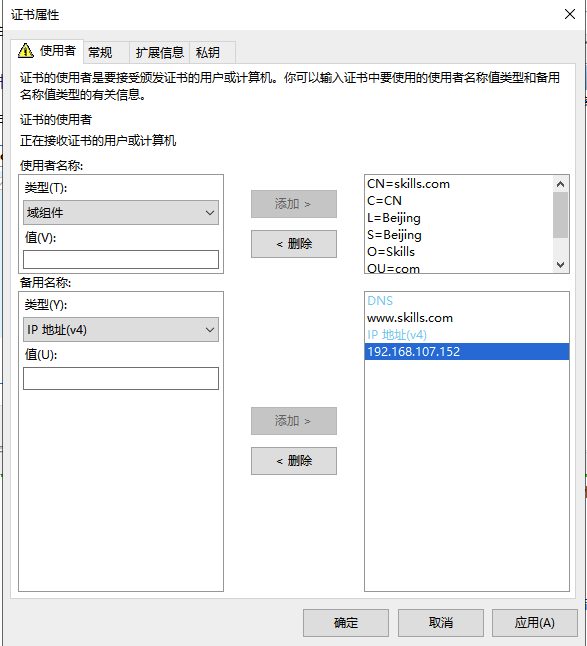
` 将脱机请求保存到桌面->保存文件名为subca.req文件格式为Base64->点击完成`
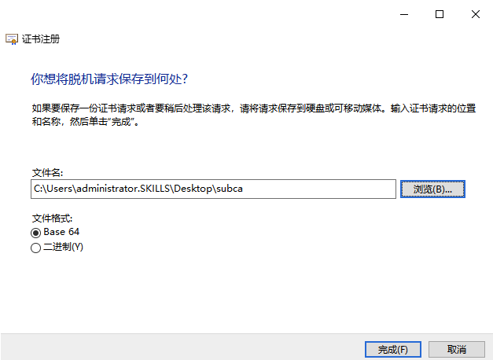
`接下来我们是用刚刚创建的证书申请subca.req，利用浏览器申请从属颁发机构证书->打开IE浏览器->访问主CA的web证书颁发机构http://192.168.107.151/certsrv->选择申请证书->高级证书申请->使用 base64编码的CMC或PKCS#10文件续订证书申请->将subca.req以记事本方式打开，复制内容到保存申请->选择证书模版为[从属证书颁发机构 的副本]->点击提交`
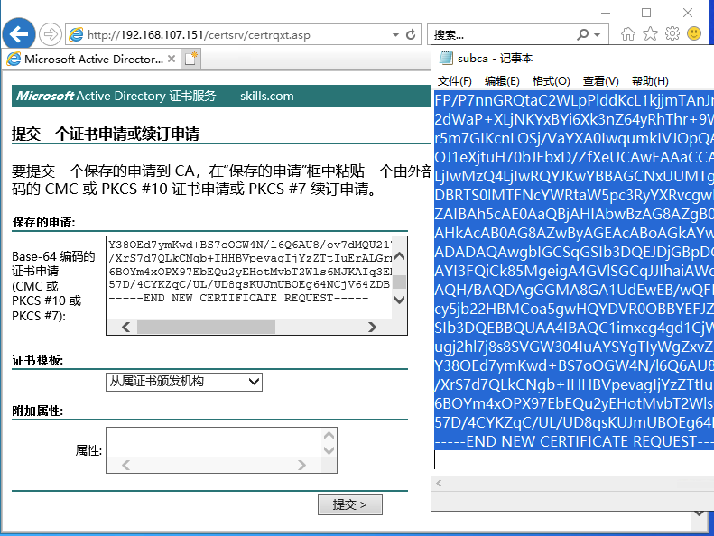
`将证书导入到Subca的本地计算机证书个人中`
![logtop1]pics/p14.png)
`安装Sub的企业从属CA证书颁发机构->在私钥选项卡选择使用现有私信->选择刚刚导入的从属颁发机构证书`
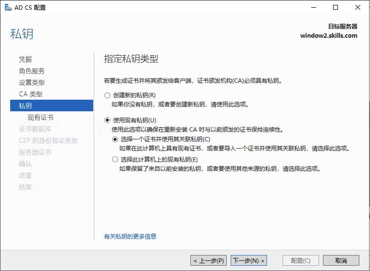
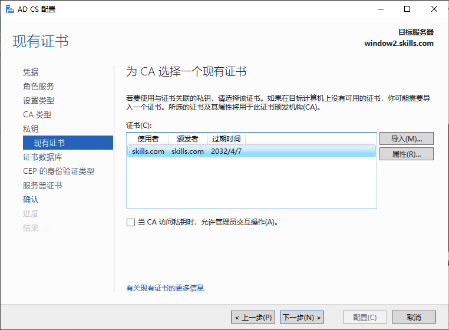
` 点击配置完成证书颁发机构创建->的继续使用如下命令行修改证书的证书的颁发时间`


```shell
certutil -setreg CA\ValidityPeriod Years       //修改有效期单位为年*
certutil -setreg CA\ValidityPeriodUnits 10   //修改有效期10年*
net stop certsvc && net start certsvc          //重启证书服务*
```
 
> **到这里从属证书颁发机构就创建完成了**

---

- **3.域中主机（含域控制器）自动申请“计算机”模板证书，自动注册“工作站身份验证”模板证书，该模板可用作“服务器身份验证”**

+ (1).在主CA上创建**工作站身份验证模版的副本
` 修改颁发时间为10年，点击在Active Directory中发布证书->在使用者名称选择[在请求中提供]->在安全选项中将权限放开，所有用户权限全部勾选自动注册`
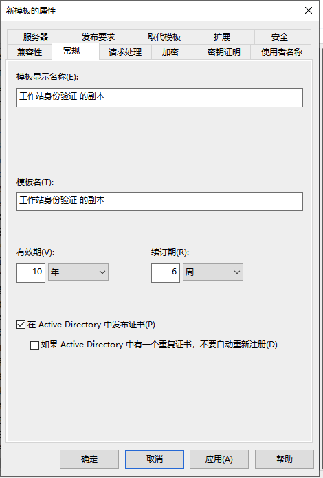


` 打开DC的组策略颁发机构->在计算机配置-> Windows设置-> 安全设置->公钥策略->选择证书服务客户端-自动注册->在配置模式中选择启用->点击确定生效配置打开自动注册功能`
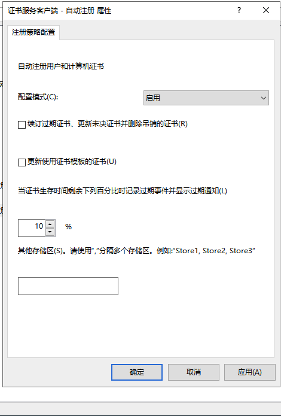
` 在受信任的根证书颁发机构->右键->导入->导入主CA的根证书`
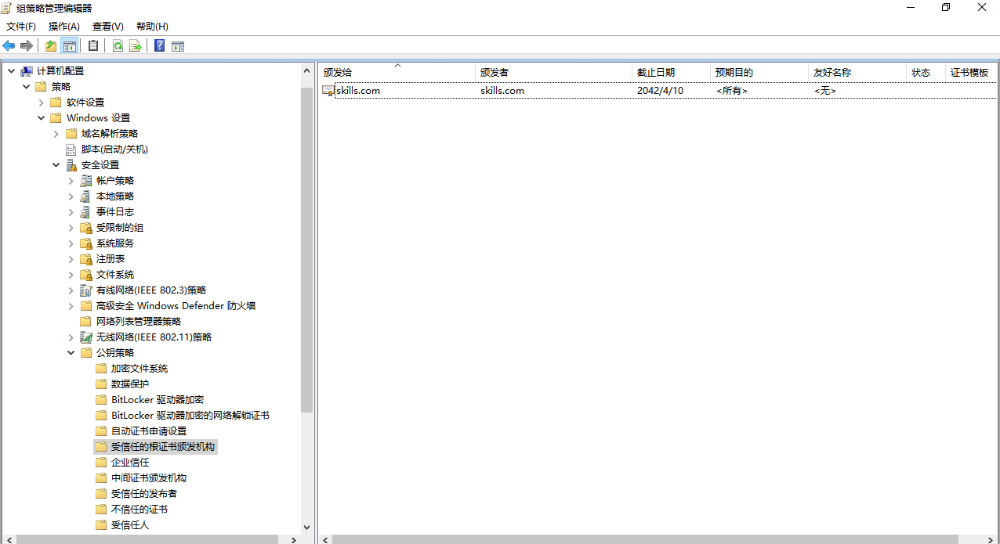
` 在自动证书申请->右键新建->自动证书申请->在模版中选择计算机->点击下一步->点击完成，就完成了自动申请计算机模版的配置`
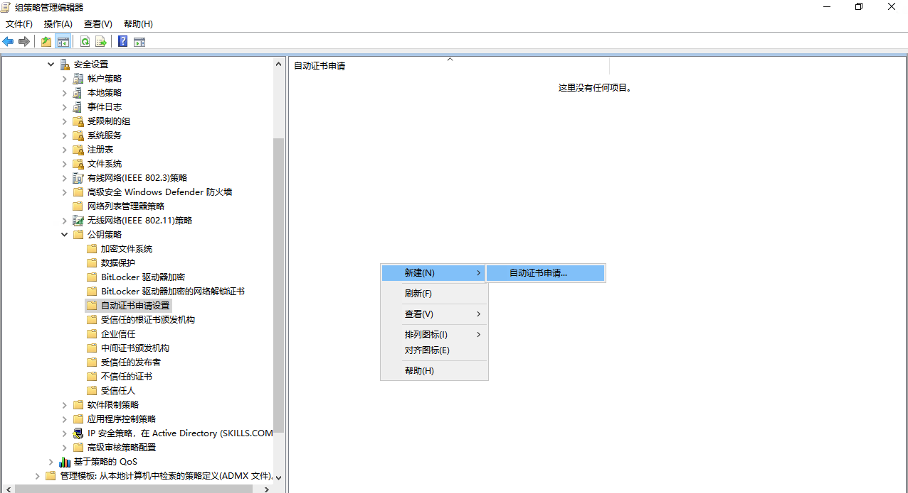
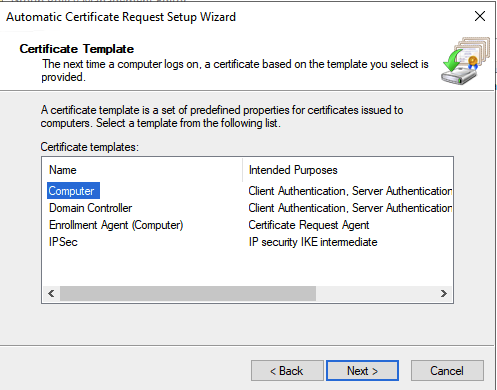