## 样题需求

> 1.把 windows3 配置为 ASP 网站，网站仅支持 dotnet CLR v4.0， 站点名称为 asp.
> 2.http 和 https 绑定本机外部网络 IP 地址，仅允许使用域名访问， 启用 HSTS，实现 http 访问自动跳转到 https。
> 3.网站目录为 C:\IIS\Contents，主页文档 index.aspx 的内容为 "HelloAspx".
> 4.启用 windows 身份验证，只有通过身份验证的用户才能访问到 该站点。
> 5.新建虚拟目录 dev，对应物理目录 C:\development，该虚拟目录 启用 windows 身份验证，只有通过身份验证的用户才能访问。
> 6.由 linux1 提供证书服务，使用 windows5 和 linux5 测试。chrome 浏 览器访问 https网站时，不出现证书警告提示信息。

---

##__样题拓扑图:__

## 具体步骤:
- **1.其中第一题到第五题属于基本配置在这里就不演示了。**
- **2.由 linux1 提供证书服务，使用 windows5 和 linux5 测试。要求chrome 浏 览器访问 https网站时，不出现证书警告提示信息。**

- (1).在由于本张试卷要求使用**工作站身份验证模版**作为服务器验证模版，所以我们先在主CA上创建一个**工作站身份验证模版的副本**:
`修改颁发时间为10年，点击在Active Directory中发布证书->在使用者名称选择[在请求中提供]->在安全选项中将权限放开，所有用户权限全部勾选自动注册->在扩展选项卡中->选择应用程序策略单击编辑->选择添加，添加服务器身份验证->单机确定完成创建`

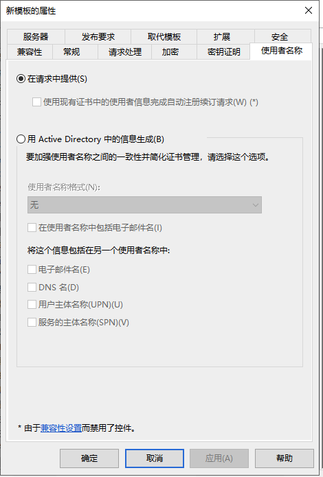
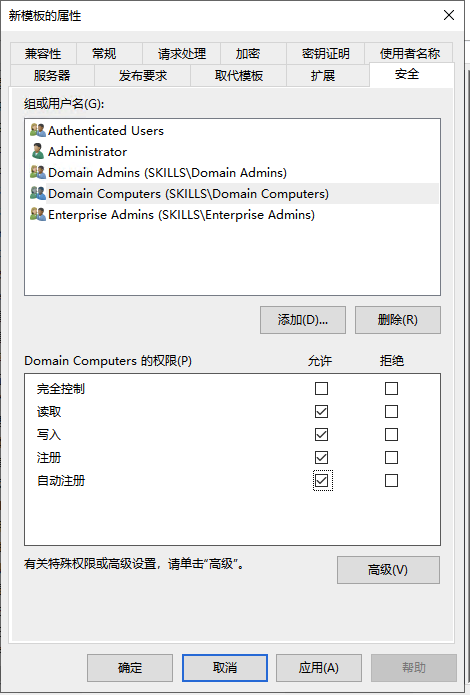
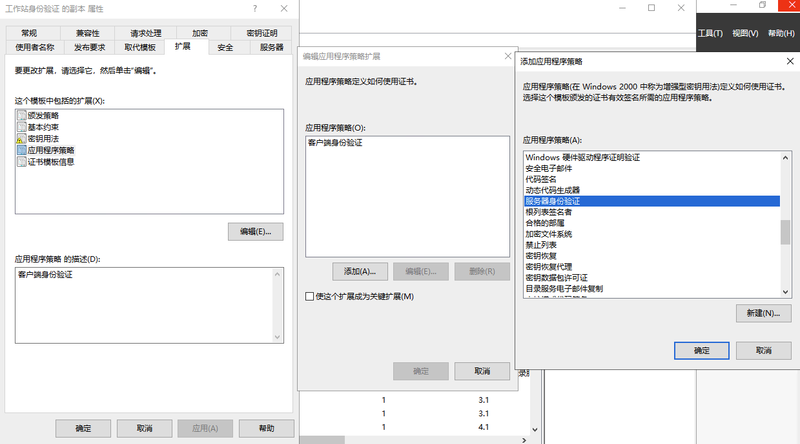

- (2).回到证书模版右键:
`选择新建->要颁发的证书模版 `
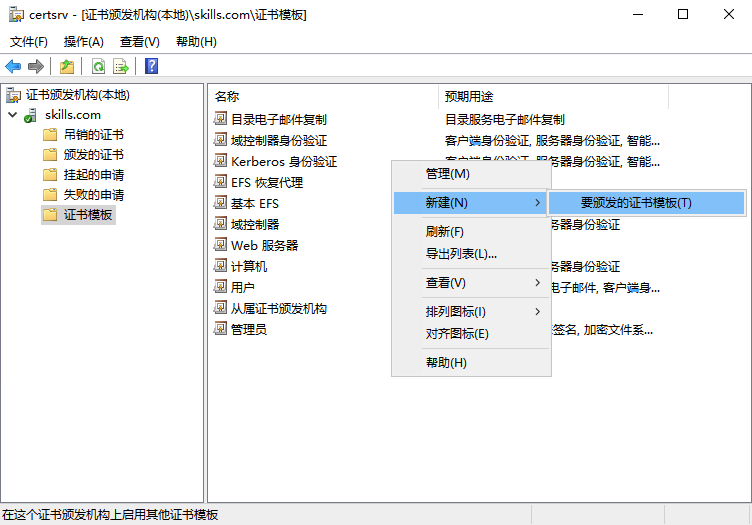
`选择工作站身份验证模版 的副本->确定 `
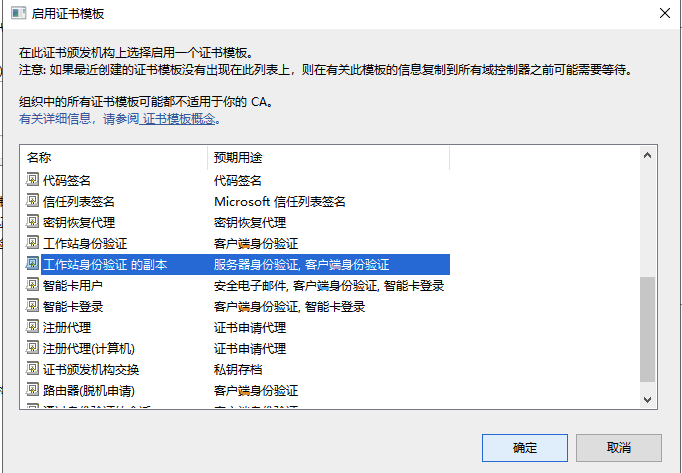

- (3).在Windows3上，利用刚刚创建的**工作站身份验证模版的副本**模版,创建一封服务器证书
` 在windows3上的运行中输入MMC->选择证书->选择计算机账户->选择个人->在空白处右键->选择所有任务->申请新证书->选择 Active Directoy注册策略->选择[工作站身份验证模版的副本]模版->点击详细信息->选择属性->在使用者选项卡中填写相关信息:公用名=skills.com，国家 =CN，省 =Beijing，城市=Beijing，组织=Skills，组织单位=System`
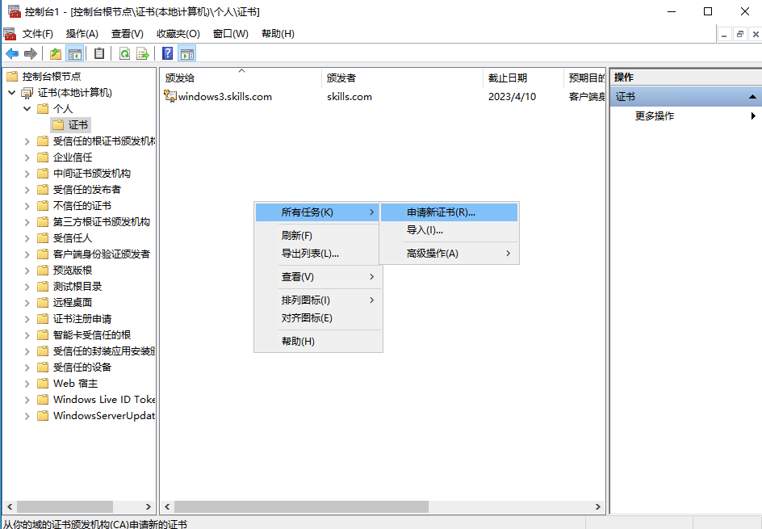
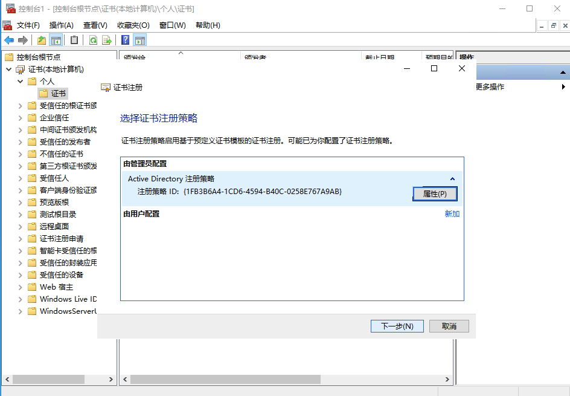
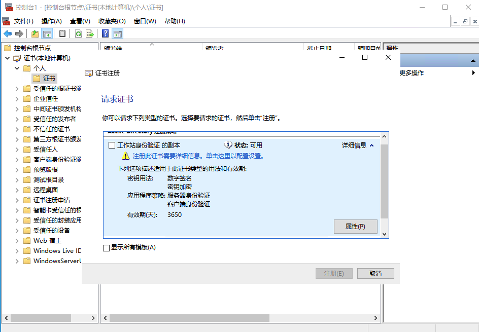
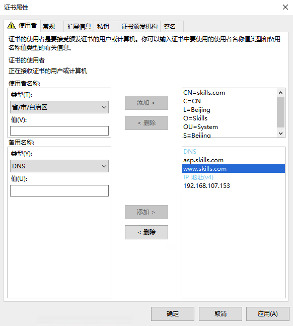

> **这里重点说明一下备用名称中的参数，如果不添加DNS，会导致访问时出现证书不安全，所以这里一定要添加DNS名称，这是新版本证书加的新特性。访问时候一定要正确的域名访问才能保证证书是安全访问的**

`如果想要表示所有skills域中的主机，可以添加*.skills.com`
`在证书颁发机构选项卡中可以添加证书的颁发机构，这里如果做了从属证书颁发机构，可以手动选择从哪一个颁发机构颁发证书，但是前提是主CA和从属CA上都有相应的证书模版才行`
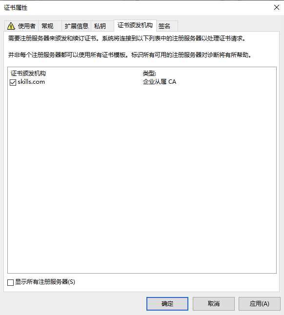

 `在私钥选项卡中选择密钥选项->点击使私钥可以导出`
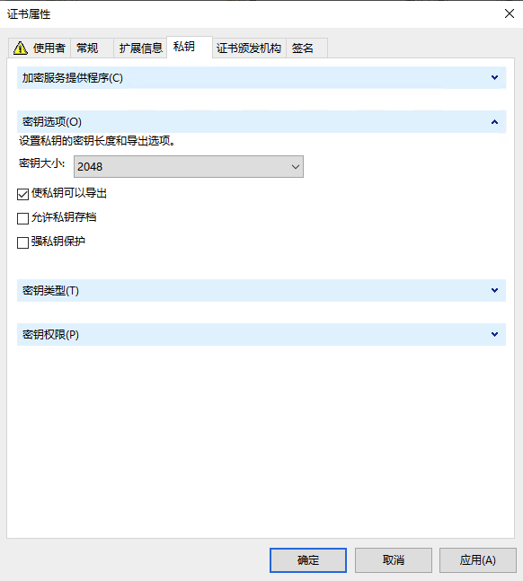

`配置好之后，点击确定，选择这一封证书模版并且单击注册->选择完成，这样web服务器的验证证书就创建好了`
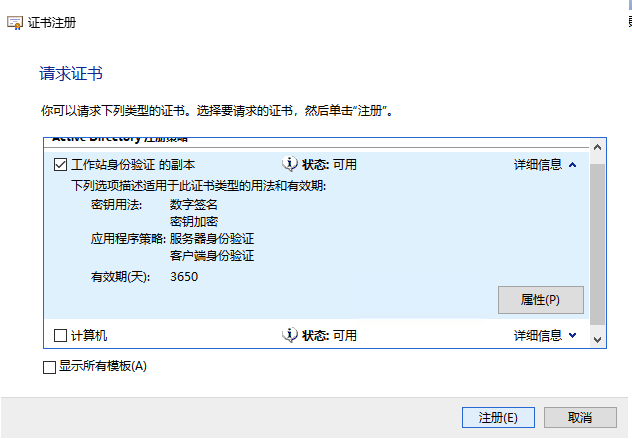
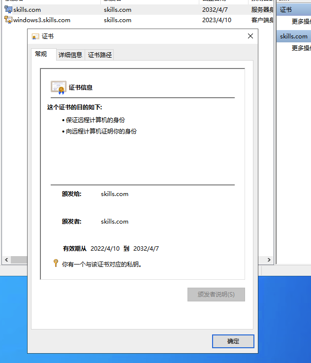

- (4).在IIS中应用这封证书
` 这封证书会直接进入IIS的证书库，不用再导入了`
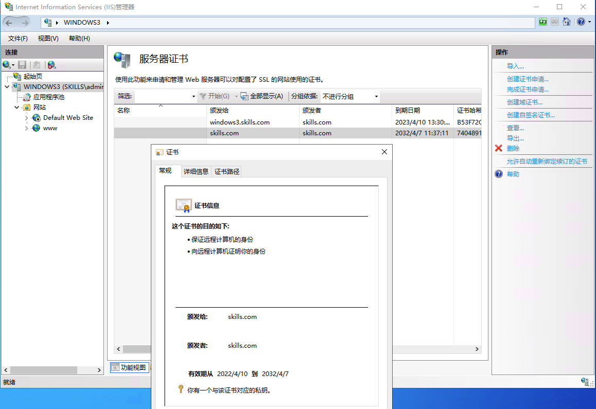

- (5).为站点添加https访问，并且绑定这封证书，然后进行访问测试先使用windowsIE浏览器进行测试

`我们首先使用https://www.skills.com这个域名进行访问`
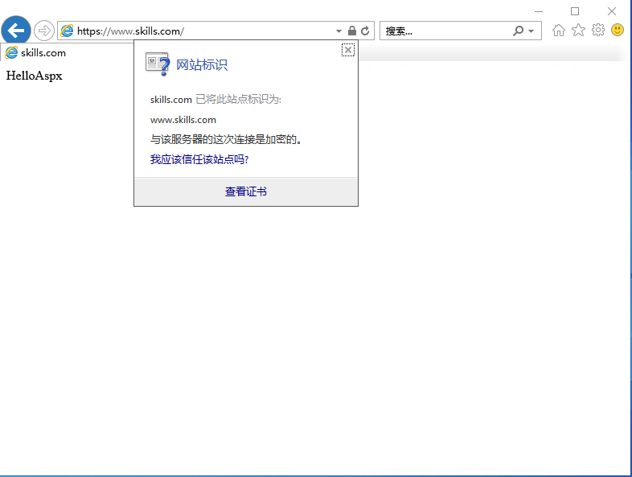
`我们发现证书没有报不安全的错误，接下来我们使用https://www1.skills.com`
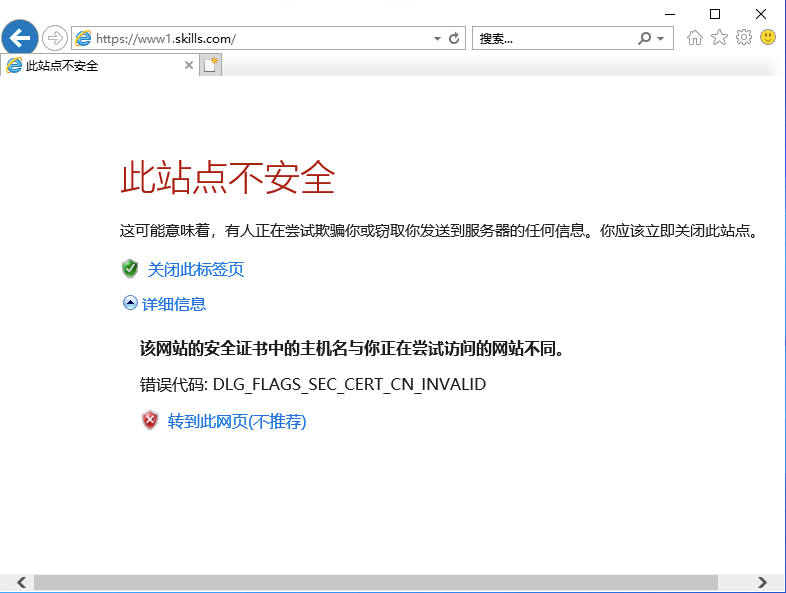

> **这里出现了一个报错[该网站的安全证书中的主机名与你正在尝试访问的网站不同。 ]这是因为我们在申请服务器证书时，没有将www1.skills.com这个域名作为备用名称写入 DNS信息中，所以CA认为它是不安全的，只有将对应的DNS名称写入对应的备用名称中，才能在访问中显示是安全的证书**

- (6).将WindowsCA的根证书导入Linux
`我们首先将颁发机构的根证书导入Linux系统用于验证,这里如果是从主CA申请的服务器证书则导入主CA的根证书，如果是从属CA申请的服务器证书则导入从属CA的根证书，但是一定要确保根证书带有DNS名称，否则将无法访问`
`这里我导入的根证书的信息如下:`
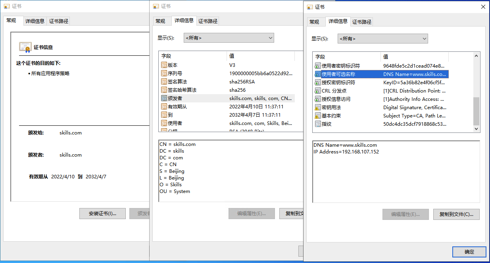

> **由于我的服务器证书是向从属CA拿的所以我上传到Linux上的证书是从属CA的根证书，我将这份根证书上传到了Linux的/opt目录下，由于Windows的证书格式是cer的Linux系统不认，我们需要通过一下命令将cer的证书转换成crt证书**
`openssl x509 -inform DER -in certnew.cer -out www.crt  //将cer格式的转换成crt证书`

(7).使用curl进行测试
`curl --cacert www.crt https://www.skills.com   //使用--cacert 后面跟windows根证书访问https://www.skills.com`
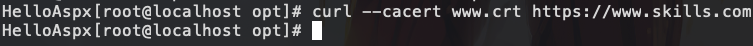

> **如果想要直接使用curl https://www.skils.com 访问，我们需要通过以下命令将Windows根证书的信息导入到Linux系统的受信颁发机构文件**Rocky8.5的受信颁发机构文件为/etc/pki/tls/certs/ca-bundle.crt使用如下命令进行导入**

`openssl x509 -in www.crt >> /etc/pki/tls/certs/ca-bundle.crt`
`使用curl https://www.skills.com进行访问测试`
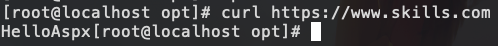
