## 样题需求
> 1.把 windows3 配置为 ASP 网站，网站仅支持 dotnet CLR v4.0， 站点名称为 asp。
> 2.http 和 https 绑定本机外部网络 IP 地址，仅允许使用域名访问， 启用 HSTS，实现 http访问自动跳转到 https。
> 3.网站目录为 C:\IIS\Contents，主页文档 index.aspx 的内容为 "HelloAspx"。
> 4.启用 windows 身份验证，只有通过身份验证的用户才能访问到 该站点。
> 5.新建虚拟目录 dev，对应物理目录 C:\development，该虚拟目录 启用 windows 身份验证，只有通过身份验证的用户才能访问。
> 6.客户端访问时，必需有 SSL 证书，证书模板为“管理员”，使用 windows5 测试。**

## 样题拓扑图
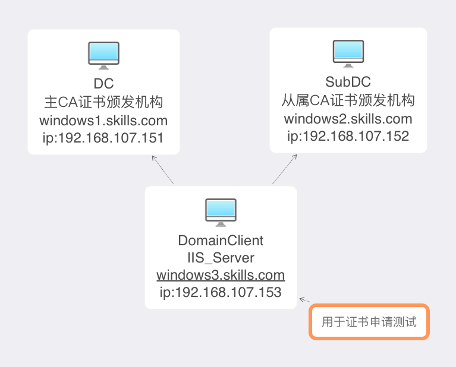

## 具体步骤:
- **1.前5题属于基本配置，这里就跳过了**
- **2.客户端访问时，必需有SSL证书，证书模板为“管理员”，使用 windows5 测试**
+ (1).由于采用了统一的证书信息:公用名=skills.com，国家 =CN，省 =Beijing，城市=Beijing，组织=Skills，组织单位=System
` 首先需要在主CA上创建一个[管理员的证书模版 的副本]模版->修改颁发时间为10年，点击在Active Directory中发布证书->在使用者名称选择[在请求中提供]->在安全选项中将权限放开，所有用户权限全部勾选自动注册->在扩展选项卡中->选择应用程序策略单击编辑->选择添加，添加服务器身份验证->单机确定完成创建`
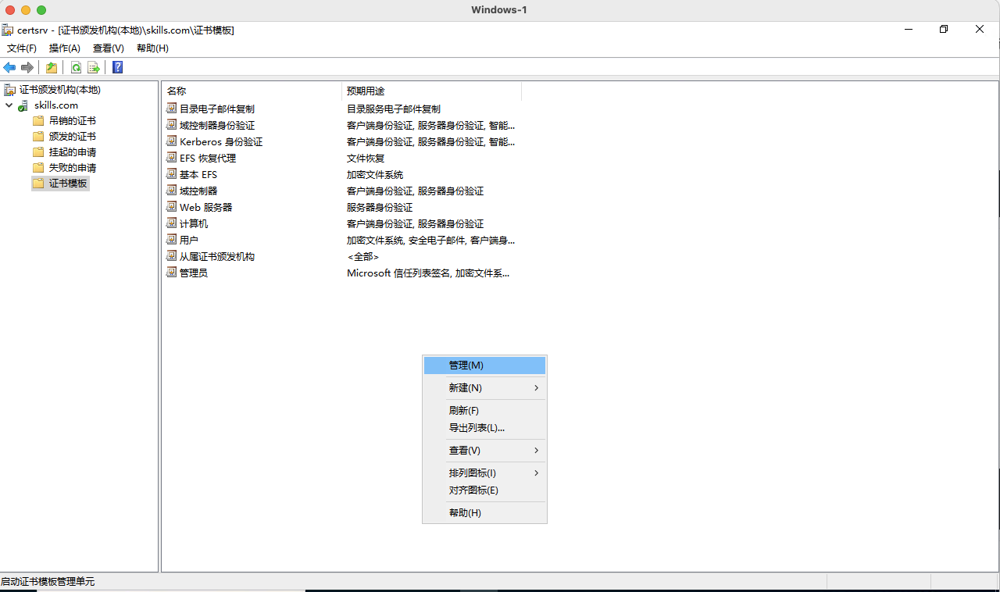
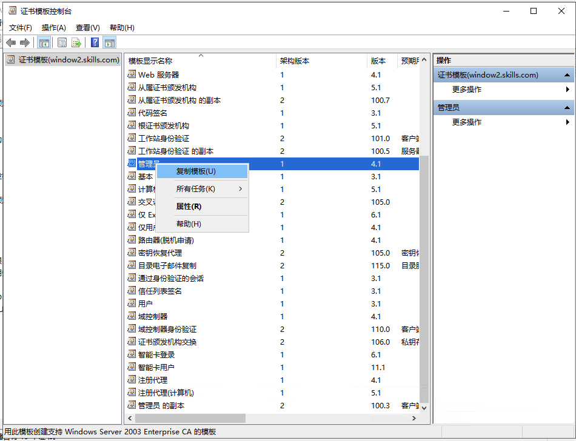
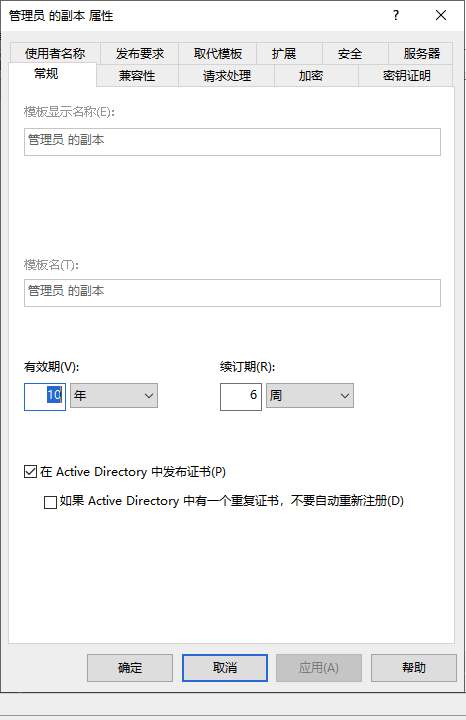
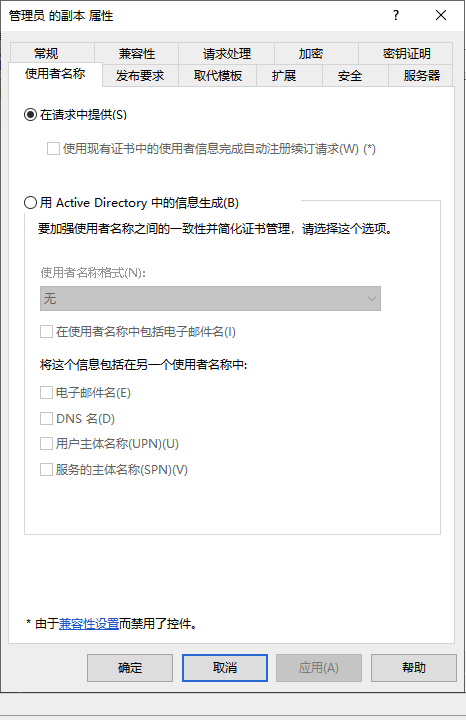
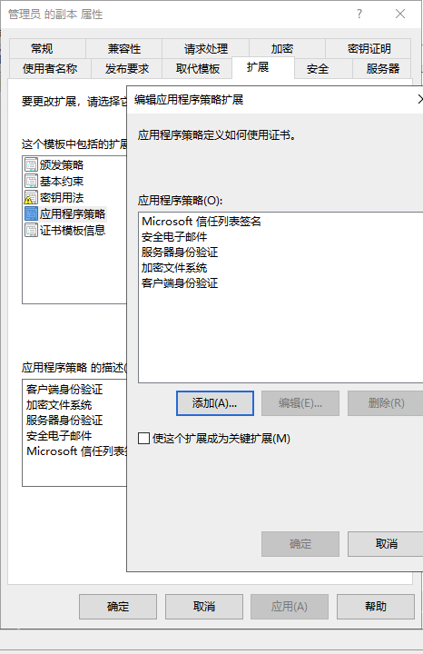
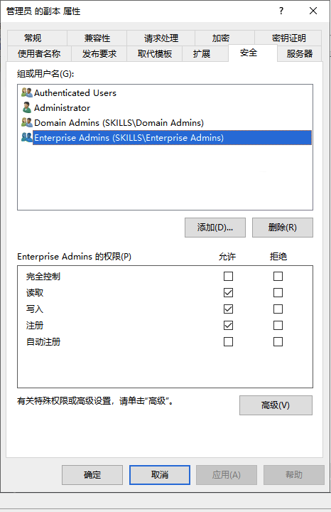

+ (2).在windows3上配置IIS服务，并且配置https服务，导入相应的服务器证书，其中服务器证书的基本信息为:*公用名=skills.com，国家 =CN，省 =Beijing，城市=Beijing，组织=Skills，组织单位=System,SAN名称中的DNS NAME=\*.skills.com*，在 SSL配置中勾选**要求 SSL**，并且在**客户证书中选择->必须**，这样客户端在访问时就必须要有一封用户证书才能正常访问IIS站点
` C=CN,S=Beijing,L=Beijing,O=Skills,OU=System,DNS=*.skills.com `
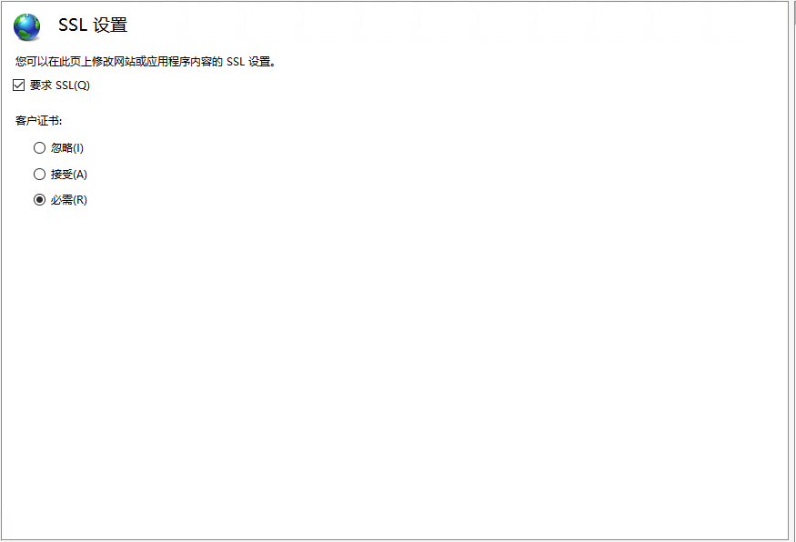

+ (3).在windows5上利用MMC中的Active Directory注册策略，申请用户证书，使用的模版为刚刚新建的[管理员的证书模版 的副本],填写基本信息为:
` C=CN,S=Beijing,L=Beijing,O=Skills,OU=System,DNS=*.skills.com `

+ (4).有关浏览器访问的问题：这里涉及到TLS的版本，其中:
  - 1.IE浏览器支持TLS 1.1、 TLS 1.2 、TLS 1.3，可以正常访问
  - 2.chrome和edge由于都是使用的chromius的内核，它们都只支持TLS 1.3，这就会导致在用chrome和edge访问时会出选无法跳出用户证书选择的页面。
   - 3.对于70版本的chrome，需要在浏览器中输入chrome://flags，然后在搜过栏输入TLS,将TLS 1.3设置为Disable就可以解决无法访问的问题。
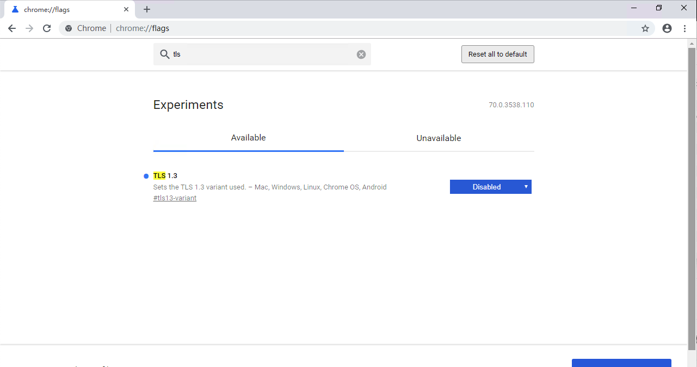

- 对于70以上的版本，我们需要添加启动参数，在桌面上的chrome浏览器图标上右键，在目标的最后面输入--ssl-version-max 1.2，强制将TLS版本指定为1.2就可以正常跳出客户端证书选择，并且正常访问网页了。
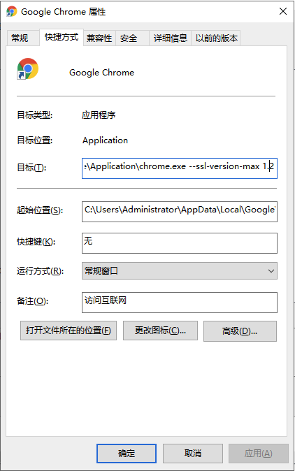

- **3.通过IIS设置不检查跳过TLS 1.3检查:**
`开启IIS->选择站点->点击绑定->选择443端口的站点->勾选通过TCP禁用TLS 1.3->点击确定`
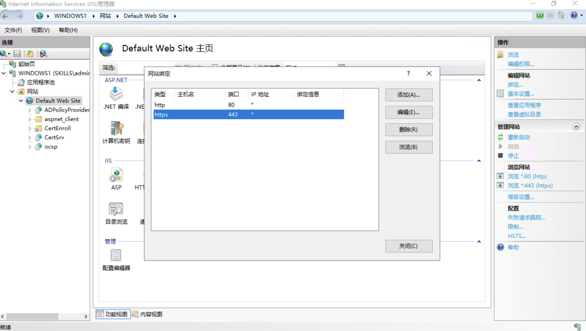
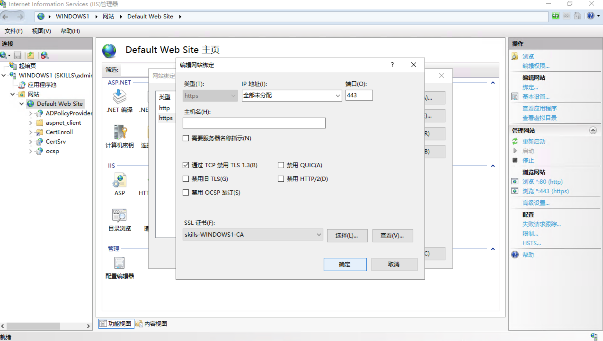