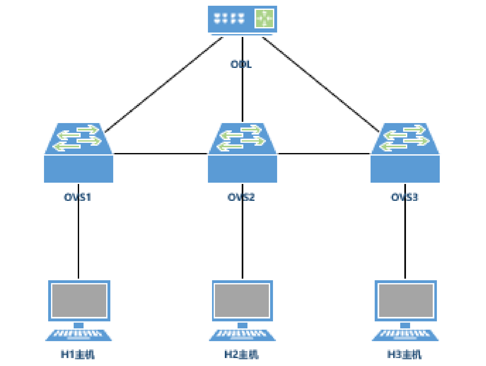
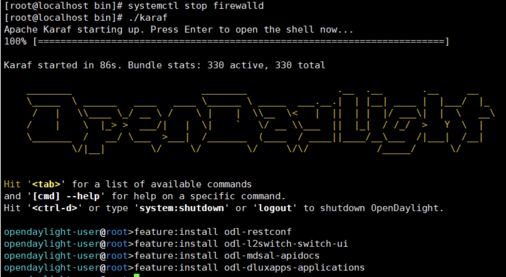
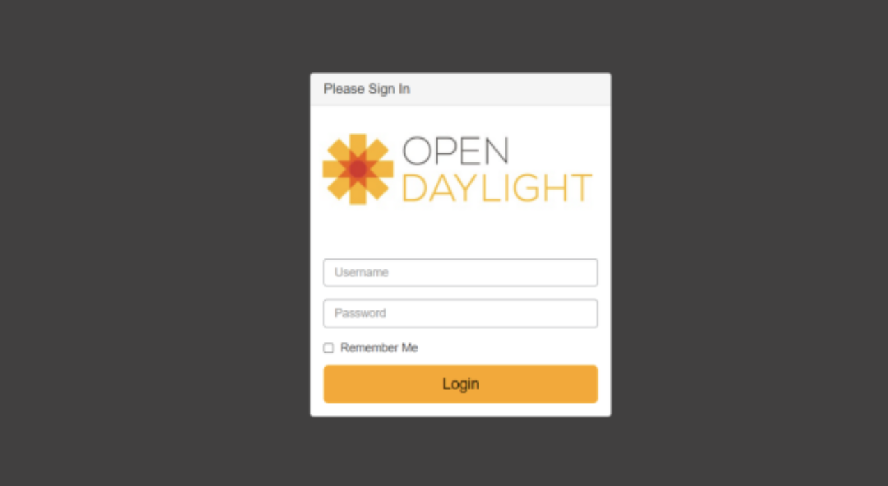
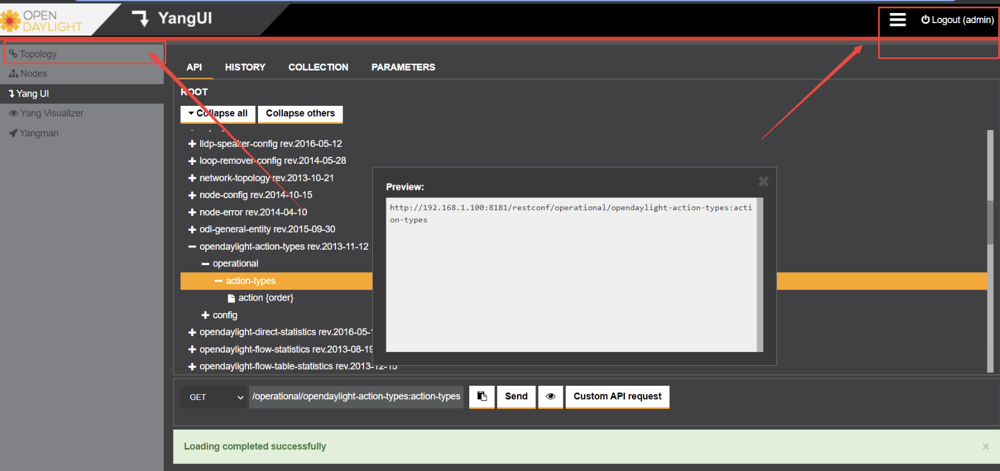
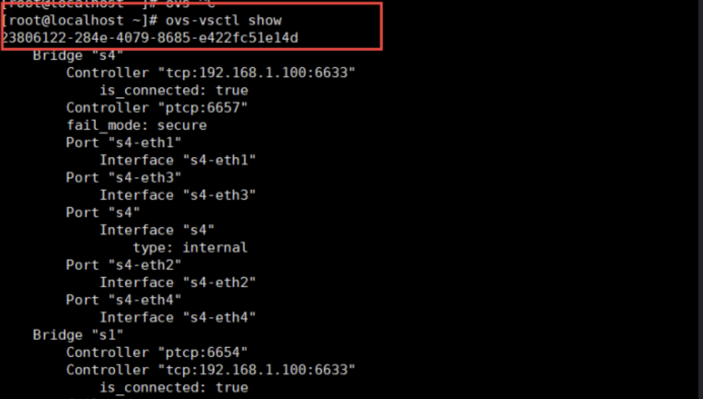

## 题目说明
- SDN 在 IspSrv 上导入 OpenDayLight 软件包；
  - 启动 OpenDayLight 的 karaf 程序，并安装如下组件：
  ```shell
  feature:install odl-restconf
  feature:install odl-l2switch-switch-ui
  feature:install odl-mdsal-apidocs
  feature:install odl-dluxapps-applications
  ```  
  - 使用 Mininet 和 OpenVswitch 构建拓扑，连接 ODL 的 6653 端口如下
拓扑结构：

- 在浏览器上可以访问 ODL 管理页面查看网元拓扑结构；
  - 通过 OVS 给 S2 下发流表，使得 H2 与 H1、H3 无法互通；
  - H1 启动 HTTP-Server 功能，WEB 端口为 8080，H3 作为 HTTP-Client，获取 H1 的 html 网页配置文件。

#### 实验环境
- Centos7.9
- distribution-karaf-0.6.0-Carbon.tar.gz
- openvswitch-2.5.0-2.el7.x86-64.rpm 
- mininet-2.2.2-2.el7.x86_64.rpm


#### 安装opendaylight需要的组件
```shell
#安装jdk和maven
yum install java* maven -y
#安装好之后的java路径为
/usr/lib/jvm/
```

#### 配置java环境变量
```shell
vim /etc/profile
source /etc/profile
JAVA_HOME=/usr/lib/jvm/java-1.8.0-openjdk-1.8.0.322.b06-1.el7_9.x86_64 #这个路径为java安装的目录路径
JRE_HOME=$JAVA_HOME/jre
CLASS_PATH=.:$JAVA_HOME/lib/dt.jar:$JAVA_HOME/lib/tools.jar:$JRE_HOME/lib
PATH=$PATH:$JAVA_HOME/bin:$JRE_HOME/bin
export JAVA_HOME JRE_HOME CLASS_PATH PATH
```

#### 安装mininet和openvswitch组件
```shell
#解压缩opendaylight压缩包，先安装以下组件
yum install scipy
yum install PyYAML
yum install libatomic
yum install net-tools
yum install telnet
yum install python*
#安装完上面组件后安装，opendaylight包中的python-networkx模块
rpm -ivh python-networkx-core-1.8.1-12.el7.noarch.rpm
rpm -ivh python-networkx-1.8.1-12.el7.noarch.rpm
#安装openvswitch
rpm -ivh openvswitch-2.5.0-2.el7.x86-64.rpm
#安装mininet
rpm -ivh mininet-2.2.2-2.el7.x86_64.rpm

#启动openvswitch
systemctl start openvswitch
```

#### 运行opendaylight控制器
```shell
#进入opendaylight目录，并启动opendaylight
cd distribution-karaf-0.6.0-Carbon/bin/
./karaf
#运行起来后在opendaylight的命令行中安装下面组件，有先后顺序，避免出错不要一行安装
feature:install odl-restconf
feature:install odl-l2switch-switch-ui
feature:install odl-mdsal-apidocs
feature:install odl-dluxapps-applications
```

- 接下来就可以通过WEB页面访问了。如果不在一个网段或者防火墙没有关闭是访问不到的。
访问地址：http://192.168.1.100:8181/index.html （这里的IP地址要改成对应服务器的地址）。如果没有错误应访问到如下页面，账号密码都是admin。


#### 使用mininet生成拓扑图并连接opendaylight控制器
```shell
mn --controller=remote,ip=192.168.1.100,port=6633 --topo=linear,3
##在mininet终端输入
pingall  #生成流表
```
- 如果mininet和上述命令输入运行成功，在OpenDayLight的WEB界面查看TOPO出现下面界面


#### 测试openvswitch是否安装成功
```shell
ovs-vsctl show
```



#### 清空mininet拓扑图
mn -c
#### 清空opendaylight安装的所有组件
./karaf clean

#### 将python作为http服务器配置
```shell
#以当前目录为网站根目录打开web服务,端口为8080
python3 -m http.server 8080
#自定义网站路径
python3 -m http.server -d /opt 80
```


#### 修改opendaylight默认的6633和6653端口
```shell
#首先运行opendaylight,并安装相应的组件
./karaf
#然后退出，这时在opendaylight目录中的etc下会生成一个opendaylight目录
#修改其中两个文件如下：
vim etc/opendaylight/datastore/initial/config/default-openflow-connection-config.xml
vim etc/opendaylight/datastore/initial/config/legacy-openflow-connection-config.xml
<switch-connection-config xmlns="urn:opendaylight:params:xml:ns:yang:openflow:switch:connection:config">
  <instance-name>openflow-switch-connection-provider-default-impl</instance-name>
  <port>6653</port>
  ...
#重新启动opendaylight
~/distribution-karaf-0.6.4-Carbon$ cd bin
~/distribution-karaf-0.6.4-Carbon/bin$ ./karaf
```

#### 使用Yangui下发流表
